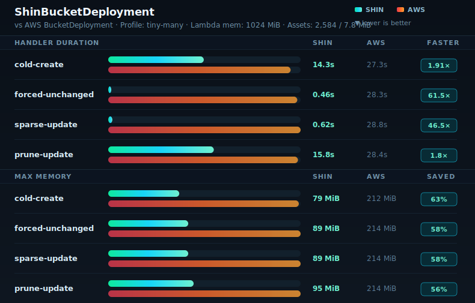

# ShinBucketDeployment

Rust-backed alternative to AWS CDK's official [`BucketDeployment`](https://docs.aws.amazon.com/cdk/api/v2/docs/aws-cdk-lib.aws_s3_deployment.BucketDeployment.html) construct.

This repository is currently a local prototype, not a published construct library. The construct API and Rust provider Lambda are working and tracked through AWS validation runs.

`ShinBucketDeployment` is intended for S3 static asset deployment when you want faster deployments, a leaner custom resource, and fewer full-archive extraction costs than the upstream construct.

## Why Build This

The official `BucketDeployment` is a good default for many stacks, but its provider is built around AWS CLI copy/sync orchestration. This construct keeps the familiar CDK surface while using a purpose-built Rust Lambda function for static asset deployment.

| Advantage                   | What changes                                                                                                                                                                                                                                                                                                                                                |
| --------------------------- | ----------------------------------------------------------------------------------------------------------------------------------------------------------------------------------------------------------------------------------------------------------------------------------------------------------------------------------------------------------- |
| Leaner runtime              | This custom resource provider runs on the [Lambda Rust runtime](https://github.com/aws/aws-lambda-rust-runtime) (`provided.al2023`) rather than the Python runtime used by the upstream provider. In practice, the lower runtime overhead can mean faster cold starts and lower memory footprint; see [lambda-perf](https://maxday.github.io/lambda-perf/). |
| Direct AWS SDK operations   | Copy, upload, delete, and CloudFront invalidation are executed through SDK calls instead of shelling out to `aws s3 cp` / `aws s3 sync`.                                                                                                                                                                                                                    |
| Archive-aware planning      | For extracted assets, the provider plans directly from the zip archive instead of extracting the whole archive to a working directory before syncing.                                                                                                                                                                                                       |
| `ETag`-based skip decisions | The provider lists the destination prefix once and compares planned content MD5 values with destination `ETag` values to skip unchanged single-part static objects.                                                                                                                                                                                         |
| Marker-free streaming path  | Missing sources without deploy-time markers stream directly from archive entries; replacement buffers are only used for sources that declare markers.                                                                                                                                                                                                       |

## Benchmark Snapshot



## Quick Start

```ts
import * as cloudfront from "aws-cdk-lib/aws-cloudfront";
import * as origins from "aws-cdk-lib/aws-cloudfront-origins";
import * as s3 from "aws-cdk-lib/aws-s3";
import { Stack } from "aws-cdk-lib";
import { Construct } from "constructs";
import { ShinBucketDeployment, Source } from "./src";

export class DemoStack extends Stack {
  constructor(scope: Construct, id: string) {
    super(scope, id);

    const bucket = new s3.Bucket(this, "WebsiteBucket");
    const distribution = new cloudfront.Distribution(this, "Distribution", {
      defaultBehavior: {
        origin: origins.S3BucketOrigin.withOriginAccessControl(bucket),
      },
    });

    new ShinBucketDeployment(this, "DeployWebsite", {
      sources: [Source.asset("site")],
      destinationBucket: bucket,
      destinationKeyPrefix: "site",
      distribution,
      prune: true,
      waitForDistributionInvalidation: true,
    });
  }
}
```

## What It Supports

The construct follows the upstream `BucketDeployment` API where the behavior maps cleanly to the Rust provider.

| Area            | Supported                                                                                                                                                                                                                    |
| --------------- | ---------------------------------------------------------------------------------------------------------------------------------------------------------------------------------------------------------------------------- |
| Sources         | `sources`, `Source.data`, `Source.jsonData`, `Source.yamlData`, `embeddedCatalog`                                                                                                                                            |
| Destination     | `destinationBucket`, `destinationKeyPrefix`, `deployedBucket`, `objectKeys`                                                                                                                                                  |
| Filtering       | `include`, `exclude`                                                                                                                                                                                                         |
| Update behavior | `extract`, `prune`, `retainOnDelete`, `outputObjectKeys`                                                                                                                                                                     |
| S3 metadata     | `accessControl`, `cacheControl`, `contentDisposition`, `contentEncoding`, `contentLanguage`, `contentType`, `metadata`, `serverSideEncryption`, `serverSideEncryptionAwsKmsKeyId`, `storageClass`, `websiteRedirectLocation` |
| CloudFront      | `distribution`, `distributionPaths`, `waitForDistributionInvalidation`                                                                                                                                                       |
| Provider Lambda | `architecture`, `bundling`, `ephemeralStorageSize`, `logGroup`, `logRetention`, `memoryLimit`, `role`, `securityGroups`, `vpc`, `vpcSubnets`                                                                                 |
| Runtime tuning  | `maxParallelTransfers`, `advancedRuntimeTuning`                                                                                                                                                                              |

Unsupported upstream props:

| Prop                                    | Reason                                                                          |
| --------------------------------------- | ------------------------------------------------------------------------------- |
| `expires`                               | Prefer `cacheControl` for deployment-time cache behavior.                       |
| `serverSideEncryptionCustomerAlgorithm` | SSE-C is intentionally not implemented; use SSE-S3 or SSE-KMS.                  |
| `signContent`                           | The provider uses AWS SDK calls directly, not the upstream AWS CLI upload path. |
| `useEfs`                                | The provider reads source archives with S3 ranges and does not use EFS.         |

## How It Works

For `extract=true`, the provider reads each source zip's central directory with ranged S3 `GetObject` requests, walks the archive entries, applies filters, and builds the deployment plan from the archive contents. Directory `Source.asset` inputs are packaged with an embedded `.shin/catalog.v1.json` MD5 catalog so unchanged marker-free files can be skipped from destination metadata. Entry data is read through coalesced source blocks with a bounded resident window. Source GET concurrency and the source window are derived from `memoryLimit` by default and can be overridden through `advancedRuntimeTuning` when diagnosing unusual workloads. It does not download the whole archive and does not write the archive or extracted entries to Lambda `/tmp`.

`ephemeralStorageSize` is accepted for upstream `BucketDeployment` API compatibility, but it is rarely useful for this provider because ZIP planning, extraction, hashing, and uploads avoid Lambda `/tmp`.

For `extract=false`, each source object is copied directly with S3 `CopyObject`.

Before uploading or copying, the provider lists the destination prefix. Destination keys are used for `prune=true`, and destination `ETag` values are used to skip unchanged objects.

For existing marker-free zip entries with catalog MD5s, the provider compares destination size and `ETag` before reading entry bytes. Without a usable catalog match, it reads and decompresses the entry from ranged source blocks, validates size and CRC32, computes MD5, and compares it with the destination `ETag`. Missing marker-free objects stream directly to S3 without pre-hashing. Entries with deploy-time markers are materialized after decompression and replacement so the final bytes can be hashed and uploaded when changed.

Marker-free ZIP entry streaming uses the same small-buffer defaults as the local `s3-unspool` extraction path: 64 KiB entry read buffers, 256 KiB S3 body chunks, and a 1 MiB body pipe between entry production and the SDK upload body. With the default 8 parallel transfers, this keeps entry stream buffering around 11 MiB, leaving the 1024 MiB default provider Lambda memory for the Rust runtime, AWS SDK, source block window, and ZIP metadata.

At the default 1024 MiB memory limit, adaptive source scheduling reserves about 64 MiB for runtime/base overhead, 96 MiB for eight transfer workers, 32 MiB for four in-flight source range requests, and 2 KiB per ZIP entry for metadata. The remaining source block window is clamped to the actual source ZIP size and capped by the adaptive model; for large enough archives it is about 448 MiB minus the file reserve after large-archive RSS slack. The default moved from 512 MiB to 1024 MiB because the `large-few` benchmark made cold-create provider duration roughly 2x faster while billed compute cost stayed in the same range; current benchmark comparisons use 512, 1024, and 2048 MiB.

CloudFront invalidation is created after S3 changes when `distribution` is provided. If `distributionPaths` is omitted, the default path is the destination prefix plus `*`, for example `/site/*`.

The provider logs one sanitized `shin_deployment_summary` JSON line per custom-resource request plus structured source scheduler and destination `PutObject` diagnostics to CloudWatch Logs. The summary includes phase timings and aggregate counters, but excludes bucket names, object keys, account IDs, distribution IDs, URLs, and ETags.

## Limits

The unchanged-object optimization depends on S3 `ETag` values behaving like MD5 content hashes. That is generally true for simple single-part static objects, but not for all S3 configurations.

Uploads or copies may not be skipped correctly for metadata-only changes, multipart objects, SSE-KMS or SSE-C objects, or any case where MD5-like `ETag` metadata is unavailable.

Zip entries with deploy-time marker replacements are fully materialized in memory after replacement so the final bytes can be hashed and uploaded. Plain zip entries are read and uploaded in chunks. Cataloged directory assets currently do not support CDK asset `bundling` or symlink-following options; pass `embeddedCatalog: false` to `Source.asset` to use the upstream CDK asset path for those cases.

Cataloged `Source.asset` packaging limitations:

- It applies to local directory assets only. Local `.zip` files and `Source.bucket` archives are consumed as provided and only benefit from a catalog if they already contain one.
- It does not run CDK asset `bundling`. Use your own pre-bundled directory, or pass `embeddedCatalog: false` to delegate packaging to CDK.
- It currently rejects symlinks instead of following or materializing them.
- It creates a temporary ZIP during synth/package time on the local machine, not inside the provider Lambda.
- It changes the staged ZIP bytes compared with upstream CDK packaging because the catalog entry is added.
- Catalog MD5s are only valid for marker-free files. Deploy-time marker replacement still requires reading and materializing final bytes.

Source archives are read with S3 ranges and do not need to fit in Lambda memory or ephemeral storage. Individual files inside the asset ZIP must be <= 5 GiB because extracted uploads currently use S3 `PutObject`, not multipart upload.

This construct targets static asset deployment to S3. It is not a general-purpose sync engine and does not provide byte-range diffing, persistent manifests, or non-S3 backend behavior.
