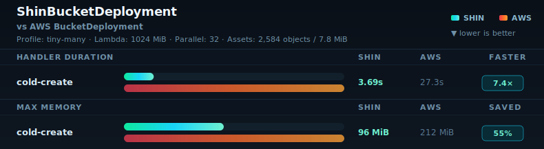

# Benchmarks

This folder contains committed benchmark support assets, not raw benchmark evidence.

README benchmark snapshots use sanitized tiny-many records from `docs/benchmark-history.jsonl`. The default snapshot keeps the four-phase 1024 MiB `maxParallelTransfers=8` Shin/AWS comparison from `2026-05-09-shin-aws-tiny-many-1024`. The parallel 32 snapshot uses the latest 1024 MiB Shin `maxParallelTransfers=32` cold-create row from `2026-05-10-shin-tiny-many-parallel-transfers-1024` with the matching AWS cold-create row.

Only README-linked snapshot SVGs are committed under `benchmarks/snapshots`. Temporary alternate layouts can be regenerated locally with `benchmarks/render/readme-snapshot.ts`, but should not be kept as committed design history. The generated benchmark report chart remains in `docs/benchmark-assets`.

## Default Snapshot

Default current snapshot with compact bar tracks and a three-line header.

## Parallel 32 Snapshot

Cold-create-only snapshot using the latest tiny-many 1024 MiB Shin `maxParallelTransfers=32` row.

