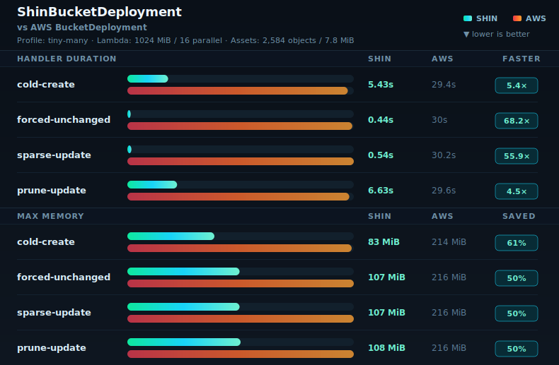
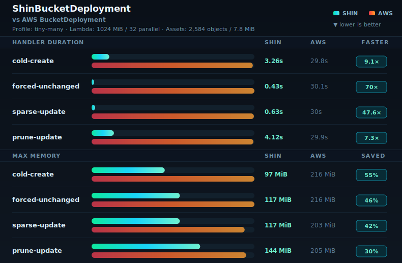
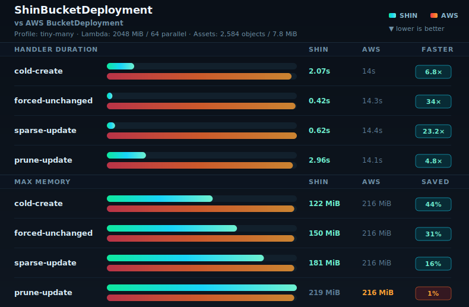
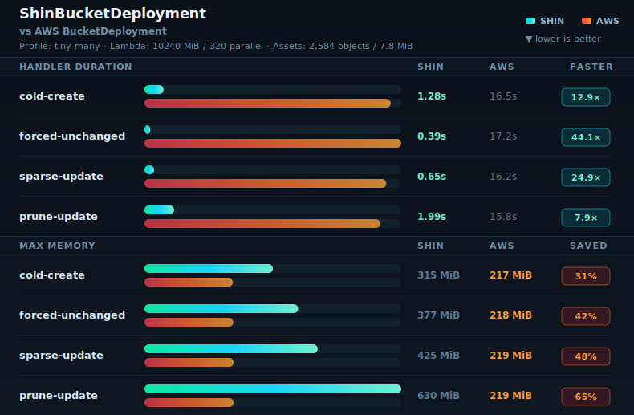

# Benchmarks

This folder contains committed benchmark support assets, sanitized current result rows, and report/render tooling. Raw benchmark evidence stays outside the repo.

Deployable benchmark CDK apps live in `benchmarks/apps/**`. Curated benchmark matrices live in `benchmarks/configs/**`, shared JSON Schemas live in `benchmarks/schemas/**`, and benchmark configs are run through `pnpm benchmark:run-assets -- --config <path>`.

README benchmark snapshots use sanitized tiny-many records from `benchmarks/results.jsonl`. Snapshot filenames follow `<profile>-<memory>mib-<parallel>.svg`, for example `tiny-many-1024mib-32.svg`.

Only README-linked snapshot SVGs are committed under `benchmarks/snapshots`. Temporary alternate layouts can be regenerated locally with `benchmarks/src/render/readme-snapshot.ts`, but should not be kept as committed design history. Generated report charts live beside the report output by default.

## Shin Provider Telemetry

- In-depth Shin provider telemetry: [`telemetry.md`](telemetry.md)
- Structured JSONL source: [`results.jsonl`](results.jsonl)

Regenerate the telemetry tables with `pnpm benchmark:telemetry-table`.

## 1024 MiB / 16 Snapshot

Four-phase snapshot using the latest tiny-many 1024 MiB Shin `maxParallelTransfers=16` rows.

## 1024 MiB / 32 Snapshot

Four-phase snapshot using the latest tiny-many 1024 MiB Shin `maxParallelTransfers=32` rows.

## 2048 MiB / 64 Snapshot

Four-phase snapshot using the latest tiny-many 2048 MiB Shin `maxParallelTransfers=64` rows.

## 4096 MiB / 128 Snapshot

Four-phase snapshot using the latest tiny-many 4096 MiB Shin `maxParallelTransfers=128` rows.

## 10240 MiB / 320 Snapshot

Four-phase snapshot using the latest tiny-many 10240 MiB Shin `maxParallelTransfers=320` rows.

