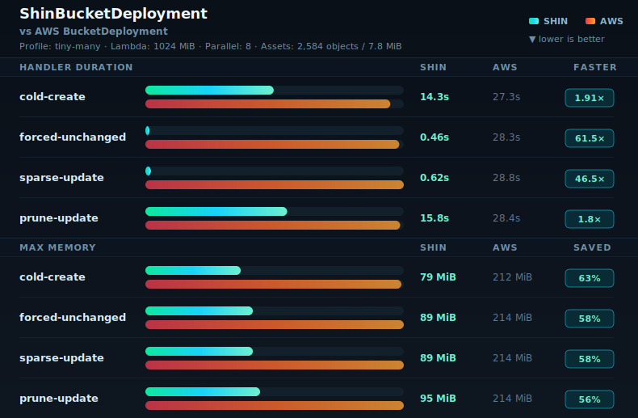
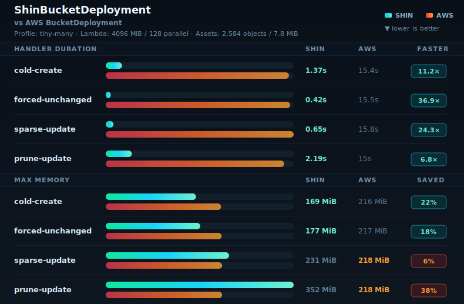

# Benchmarks

This folder contains committed benchmark support assets, sanitized current result rows, and report/render tooling. Raw benchmark evidence stays outside the repo.

Deployable benchmark CDK apps live in `benchmarks/apps/**`. Curated benchmark matrices live in `benchmarks/configs/**`, shared JSON Schemas live in `benchmarks/schemas/**`, and benchmark configs are run through `pnpm benchmark:run-assets -- --config <path>`.

README benchmark snapshots use sanitized tiny-many records from `benchmarks/results.jsonl`. The default snapshot keeps the four-phase 1024 MiB `maxParallelTransfers=8` Shin/AWS comparison from `2026-05-09-shin-aws-tiny-many-1024`. The parallel 64 and parallel 128 snapshots use the paired Shin/AWS run from `2026-05-14-shin-aws-tiny-many-2048-64-4096-128`.

Only README-linked snapshot SVGs are committed under `benchmarks/snapshots`. Temporary alternate layouts can be regenerated locally with `benchmarks/src/render/readme-snapshot.ts`, but should not be kept as committed design history. Generated report charts live beside the report output by default.

## Default Snapshot

Default current snapshot with compact bar tracks and a three-line header.

## Parallel 64 Snapshot

Four-phase snapshot using the latest tiny-many 2048 MiB Shin `maxParallelTransfers=64` rows.

## Parallel 128 Snapshot

Four-phase snapshot using the latest tiny-many 4096 MiB Shin `maxParallelTransfers=128` rows.

