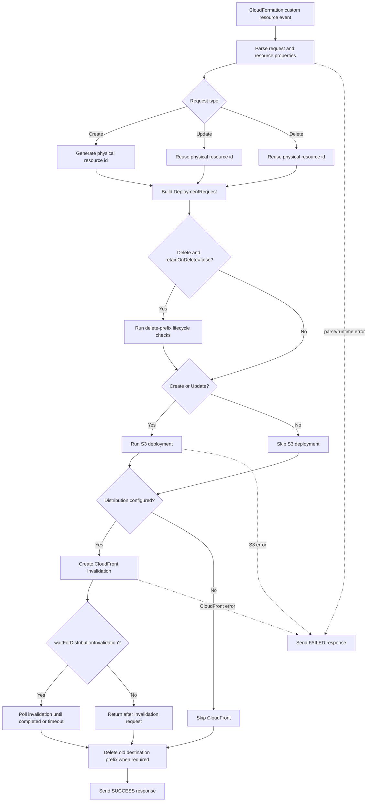
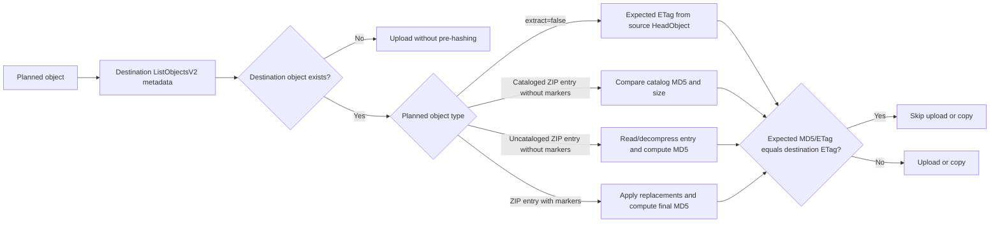

# Architecture

This document is the source of truth for the current `ShinBucketDeployment` provider architecture. See [s3-unspool parity](./s3-unspool-parity.md) for the optimization comparison matrix.

## Runtime Shape

`ShinBucketDeployment` is a Rust-backed CDK custom resource for S3 static asset deployment. It keeps the familiar `BucketDeployment`-style construct API while replacing the upstream AWS CLI sync path with direct AWS SDK operations.

The provider Lambda:

- plans objects directly from source archives or source objects
- reads extracted ZIP sources with ranged S3 `GetObject` requests
- does not download the full ZIP to memory
- does not write the source ZIP or extracted entries to Lambda `/tmp`
- lists the destination prefix once with `ListObjectsV2`
- skips unchanged objects when destination metadata is sufficient
- uploads changed extracted objects with `PutObject`
- copies `extract=false` sources with `CopyObject`
- deletes destination keys not present in the plan when `prune=true`
- creates optional CloudFront invalidations after S3 changes

Runtime tuning defaults:

| Setting | Default | Purpose |
| --- | ---: | --- |
| `maxParallelTransfers` | 8 | Bounds copy, hash, upload, and related transfer work. |
| `ephemeralStorageSize` | CDK Lambda default | Accepted for upstream API compatibility, but usually not useful because the provider avoids Lambda `/tmp`. |

Most deployments should tune only `memoryLimit` and, when needed, `maxParallelTransfers`. Source block/window and `PutObject` retry settings remain available under `advancedRuntimeTuning` as support and benchmark escape hatches:

| Advanced setting | Default | Purpose |
| --- | ---: | --- |
| `advancedRuntimeTuning.sourceBlockBytes` | 8 MiB | Source range block size for ZIP entry reads. |
| `advancedRuntimeTuning.sourceBlockMergeGapBytes` | 256 KiB | Maximum gap for coalescing adjacent source spans. |
| `advancedRuntimeTuning.sourceGetConcurrency` | derived from Lambda memory, 1 to 8 | Maximum concurrent source ranged `GetObject` block fetches per archive. |
| `advancedRuntimeTuning.sourceWindowBytes` | derived from Lambda memory and ZIP file count | Maximum resident source block data per ZIP archive; a single larger block can still be admitted. |
| `advancedRuntimeTuning.sourceWindowMemoryBudgetMb` | provider Lambda `memoryLimit` | Memory budget used for adaptive source window sizing. |
| `advancedRuntimeTuning.putObjectRetry.maxAttempts` | 6 | Maximum application-level `PutObject` attempts. |
| `advancedRuntimeTuning.putObjectRetry.baseDelayMs` / `maxDelayMs` | 250 / 5000 | Capped non-throttling `PutObject` retry delay. |
| `advancedRuntimeTuning.putObjectRetry.slowdownBaseDelayMs` / `slowdownMaxDelayMs` | 1000 / 30000 | Capped throttling `PutObject` retry delay. |
| `advancedRuntimeTuning.putObjectRetry.jitter` | `full` | Jitter mode for computed `PutObject` retry delays; `none` is also supported. |

Fixed ZIP entry streaming defaults intentionally match the local `s3-unspool` extraction path:

| Internal setting | Default | Purpose |
| --- | ---: | --- |
| ZIP entry read buffer | 64 KiB | Pulls decompressed entry bytes for size validation, CRC32, MD5, marker input, and upload production. |
| ZIP entry S3 body chunk | 256 KiB | Size of each `Bytes` frame offered to the destination `PutObject` body. |
| ZIP entry body pipe capacity | 1 MiB | Backpressure between entry production and the SDK upload body consumer. |

The default provider Lambda memory is 1024 MiB. That default is sized around the adaptive memory model used for source blocks and transfer work rather than around source ZIP size. The default was raised from 512 MiB because the 2026-05-02 `large-few` benchmark made cold-create provider duration roughly 2x faster while keeping billed compute cost in the same range. The active memory comparison set is 512, 1024, and 2048 MiB.

| Budget item at default settings | Approximate budget |
| --- | ---: |
| Runtime/base reserve | 64 MiB |
| Transfer worker reserve, `8 * 12 MiB` | 96 MiB |
| Source ranged `GetObject` in-flight reserve, `4 * 8 MiB` | 32 MiB |
| ZIP entry metadata reserve | 2 KiB per file |
| Remaining source block window | About 448 MiB minus the file reserve for large enough archives, clamped to the source ZIP size |

The explicit streaming buffers are small enough to fit inside the transfer worker reserve: each active marker-free upload stream uses about 64 KiB read buffer, 64 KiB held-back validation buffer, 256 KiB body assembly buffer, and up to 1 MiB of queued body frames. At eight active transfers that is roughly 11 MiB of entry stream buffering. For 2,500 ZIP entries, the file reserve is about 5 MiB and the adaptive source window can grow to about 443 MiB when the source ZIP is large enough. For small archives, the source window is clamped down to the actual source ZIP size, so observed RSS is much lower than the worst-case budget.

Adaptive source window formula:

```text
sourceGetConcurrency = clamp(memoryLimitMiB / 256, 1, 8)

reservedBytes =
  64 MiB
  + (maxParallelTransfers * 12 MiB)
  + (zipFileCount * 2 KiB)
  + (sourceGetConcurrency * sourceBlockBytes)

capacityBytes = min(memoryBudgetBytes - reservedBytes, sourceZipBytes)

if capacityBytes > 512 MiB:
  capacityBytes -= 384 MiB

sourceWindowBytes = min(capacityBytes, 512 MiB)
sourceWindowBytes = max(sourceWindowBytes, min(sourceBlockBytes, sourceZipBytes))
```

`memoryBudgetBytes` defaults to `memoryLimit` but can be isolated with `advancedRuntimeTuning.sourceWindowMemoryBudgetMb`. The final `max` ensures at least one source block can be admitted, while the `min(sourceZipBytes)` clamp avoids reserving more resident source data than the archive can contain.

## Supported Scenarios

Scenarios are driven through the repository runner. Verification mode runs every default correctness scenario when no name is provided; benchmark mode runs the selected benchmark scenario across the requested config matrix.

```bash
pnpm verify list
pnpm verify synth
pnpm verify deploy --concurrency 4
pnpm verify deploy cloudfront-wait
pnpm benchmark deploy assets --profiles tiny-many --states baseline --memory-mb 1024 --parallel 32 --implementations shin,aws
```

Verification deploy/destroy can run independent scenario chains concurrently with `--concurrency`; ordered update chains still run in sequence within each chain.

| Scenario | File | Purpose |
| --- | --- | --- |
| `simple` | `scenarios/apps/basic/simple-app.ts` | Plain deployment under a destination prefix. |
| `root-prefix` | `scenarios/apps/basic/root-prefix-app.ts` | Deployment without `destinationKeyPrefix`, writing at bucket root. |
| `marker-replacement` | `scenarios/apps/metadata/marker-replacement-app.ts` | Deploy-time marker replacement across asset, data, JSON, and YAML sources. |
| `metadata-and-filters` | `scenarios/apps/metadata/metadata-and-filters-app.ts` | Include/exclude filters and S3 metadata mapping. |
| `source-overwrite-order` | `scenarios/apps/metadata/source-overwrite-order-app.ts` | Duplicate source keys where later sources win. |
| `prune-update-v1` / `prune-update-v2` | `scenarios/apps/updates/prune-update-v1-app.ts`, `scenarios/apps/updates/prune-update-v2-app.ts` | Update path that removes destination objects absent from the new source plan. |
| `prune-disabled-v1` / `prune-disabled-v2` | `scenarios/apps/updates/prune-disabled-v1-app.ts`, `scenarios/apps/updates/prune-disabled-v2-app.ts` | Update path with `prune=false`, preserving destination objects absent from the new source plan. |
| `retain-on-delete-v1` / `retain-on-delete-v2` | `scenarios/apps/retention/retain-on-delete-v1-app.ts`, `scenarios/apps/retention/retain-on-delete-v2-app.ts` | Update/delete behavior when `retainOnDelete=true`. |
| `delete-cleanup-v1` / `delete-cleanup-v2` / `delete-cleanup-bucket-only` | `scenarios/apps/retention/delete-cleanup-v1-app.ts`, `scenarios/apps/retention/delete-cleanup-v2-app.ts`, `scenarios/apps/retention/delete-cleanup-bucket-only-app.ts` | Update/delete behavior when `retainOnDelete=false`. |
| `extract-false` | `scenarios/apps/basic/extract-false-app.ts` | Archive copy mode with `extract=false`. |
| `large-archive` | `scenarios/apps/scale/large-archive-app.ts` | Larger archive ranged-read path. |
| `kms-destination` | `scenarios/apps/security/kms-destination-app.ts` | KMS-encrypted destination bucket. |
| `cloudfront-wait` | `scenarios/apps/cloudfront/cloudfront-wait-app.ts` | CloudFront invalidation with explicit paths and stack wait. |
| `cloudfront-no-wait` | `scenarios/apps/cloudfront/cloudfront-no-wait-app.ts` | CloudFront invalidation with default paths and no stack wait. |
| `assets` | `benchmarks/apps/assets-app.ts` | Deterministic benchmark asset bundles. |

## Handler Flow



## S3 Deployment Flow

For `extract=true`:

1. `HeadObject` the source ZIP.
2. Read ZIP central directory metadata with ranged `GetObject`.
3. Walk central-directory entries.
4. Apply include and exclude filters.
5. Load the embedded `.shin/catalog.v1.json` catalog when present.
6. Build a manifest of planned ZIP entries with normalized destination keys, source archive index, entry offsets, compressed size, uncompressed size, CRC32, and optional catalog MD5.
7. Coalesce planned source spans into shared source blocks, prefetch them with bounded source GET concurrency, and release blocks after all active readers consume their claims.
8. List the destination prefix once.
9. Skip existing marker-free cataloged entries when destination size and `ETag` match the catalog.
10. For missing marker-free destination objects, stream the source entry directly into `PutObject`.
11. For existing marker-free destination objects without a catalog match, read/decompress the entry through ranged source blocks, validate uncompressed size and CRC32, compute MD5, and compare it with the destination `ETag` from the list response.
12. Materialize marker entries in memory after decompression and CRC validation, apply replacements, compute MD5 over final bytes, and upload when changed.

For `extract=false`:

1. `HeadObject` each source object.
2. Build copy plans using the source object `ETag` as the expected content identity.
3. List the destination prefix once.
4. Skip copies whose destination `ETag` matches.
5. Run changed copies with `CopyObject` and `MetadataDirective=REPLACE`.

Destination listing is also used for pruning. With `prune=true`, objects under the destination prefix that are not in the current deployment plan are removed with `DeleteObjects` in 1000-key chunks.

## Skip Decisions



The provider intentionally uses destination `ETag` as the only unchanged-object skip identity. `ListObjectsV2` exposes the destination `ETag`, but it does not expose the actual checksum value needed to compare S3 `ChecksumCRC32`. Using CRC32 for skip decisions would require one checksum-mode `HeadObject` per destination object, which is not worth the request volume for this deployment model.

Directory `Source.asset` inputs are packaged with an embedded source MD5 catalog. Marker-free ZIP entries with catalog MD5s and matching destination size can be skipped without reading ZIP entry bytes. Without an embedded catalog match, marker-free ZIP entries that already exist at the destination must be read and decompressed to compute MD5. Missing marker-free objects skip this pre-hash and stream straight to upload. ZIP entry reads validate declared uncompressed size and CRC32 before the final upload chunk is released. Entries with deploy-time markers are fully materialized in memory, replacements are applied, and MD5 is computed over the final replaced bytes.

`extract=false` copies use source and destination `ETag` comparison for skipping. Source object `ETag` comes from a source `HeadObject`; destination `ETag` comes from the single destination list.

## Write Safety

Extracted uploads use destination preconditions derived from the destination listing. Missing destination keys are uploaded with `If-None-Match: *`; existing destination keys with a listed `ETag` are uploaded with `If-Match` for that `ETag`; existing keys without a usable `ETag` fall back to plain `PutObject`. This keeps the deployment optimistic-concurrency-safe without adding extra destination requests. A `PreconditionFailed` response means the destination changed after planning and the deployment should fail rather than overwrite a concurrent writer.

The source ZIP ranged-read path still uses source `If-Match` when the source object has an `ETag`; that protects a single deployment from reading a source archive that changes while it is being streamed.

`extract=false` remains on the `CopyObject` path. Its skip decision uses `ETag`, and changed copies overwrite the destination object.

CloudFront invalidations use a bounded caller reference hash derived from the CloudFormation request identity (`StackId`, `RequestId`, and logical resource id) plus the distribution id and invalidation paths. CloudFormation documents `StackId` plus `RequestId` as a way to uniquely identify a request on a custom resource, and CloudFront documents `CallerReference` as the idempotency value that prevents accidentally resubmitting an identical invalidation request. If Lambda retries the same custom-resource event after creating the invalidation but before sending the CloudFormation response, CloudFront returns the existing invalidation instead of creating a duplicate. The upstream CDK `BucketDeployment` provider currently uses a fresh `uuid4()` caller reference for each invocation; this provider intentionally uses the request-derived caller reference to make same-event retries idempotent at the CloudFront API boundary.

CloudFormation failure responses use a truncated `Reason` string. CloudFormation documents a 4096-byte maximum custom-resource response body, and `Reason` is part of that body. The provider keeps the full error in CloudWatch Logs but caps the response reason so a long Rust/AWS SDK error chain does not turn a useful deployment failure into an oversized or missing custom-resource response.

## IAM Shape

The provider role uses source grants from each bound CDK source and destination grants from the target bucket. Destination object write/delete permissions are scoped to `destinationKeyPrefix` when the prefix is concrete. Destination `ListBucket` is also scoped with `s3:prefix` when the current prefix is concrete and `retainOnDelete` is not `false`.

When `retainOnDelete=false`, delete/list permissions remain broader because update and delete events may need to clean up an old destination prefix from previous resource properties. Tokenized prefixes also fall back to broader grants because their final prefix cannot be represented as a static IAM resource or condition at synthesis time.

## Engine Transition

The older extract path downloaded each source ZIP from S3, wrote the full archive to Lambda `/tmp`, opened it with `ZipArchive`, and reread the temporary file for planning, fallback hashing, and upload streaming.

The current path reads the ZIP central directory and entry bodies through S3 ranges. Directory assets are packaged with the same embedded catalog shape used by `s3-unspool`. Entry source spans are planned into coalesced blocks, prefetched with bounded source GET concurrency, shared by concurrent readers, retained while claimed, and reopened for retryable upload bodies. This removes the full-archive ephemeral-storage dependency and makes source ZIP size independent of Lambda `/tmp`. Replacement-expanded entries still must fit in memory because their final bytes are only known after marker substitution.

The current implementation intentionally adopted these `s3-unspool` ideas:

- avoid local archive staging
- avoid full archive loading
- treat the ZIP object as a random-access S3 source
- read central-directory metadata through ranges
- reopen entry streams from ranges so upload bodies are retryable
- use separate S3 clients for source reads and destination writes
- use embedded source MD5 catalogs for sparse unchanged skips
- coalesce adjacent source spans into shared source blocks
- prefetch source blocks with bounded source GET concurrency
- bound resident source block data and release blocks by reader claims
- validate ZIP entry uncompressed size and CRC32 during hashing and upload
- keep destination listing as the central comparison input
- use source-object `If-Match` guards for ranged archive reads
- use destination `If-None-Match`/`If-Match` guards for extracted `PutObject` writes when listing data supports them
- retry failed `PutObject` attempts with capped backoff and throttle-aware delays
- derive source GET concurrency and source block window from Lambda memory unless explicitly configured
- emit structured source scheduler and destination `PutObject` diagnostics as provider logs

The remaining catalog caveat is packaging compatibility. Cataloged directory assets are produced by this construct's `Source.asset` wrapper. If callers need CDK asset bundling or symlink-following behavior that the wrapper does not currently implement, they can pass `embeddedCatalog: false` and use the upstream CDK asset path without catalog sparse skips.

Cataloged asset packaging limitations:

- Local directory assets are cataloged by default; local `.zip` files and `Source.bucket` archives are not rewritten.
- Existing catalogs in caller-provided ZIPs are consumed by the provider if present, but this construct does not inject catalogs into those ZIPs.
- CDK asset `bundling` is not run by the cataloged wrapper. Use a pre-bundled directory or `embeddedCatalog: false`.
- Symlinks are rejected by cataloged packaging until follow/materialization semantics are implemented.
- The cataloged wrapper creates a temporary ZIP during synth/package time and changes the staged ZIP content hash compared with upstream CDK packaging.
- Catalog MD5 entries are only used for marker-free files; deploy-time marker replacement invalidates package-time MD5s.

## Diagnostics

Each extracted deployment logs the effective source schedule and a final source diagnostics record per source archive. These records include planned entries and blocks, planned and fetched source bytes, source amplification, ranged `GetObject` attempts/retries/errors, block hits/misses/releases/refetches, split wait counters for in-flight fetches versus source-window capacity, replay-claim counters, resident source-window high-water, active ZIP entry reader high-water, and active source GET high-water. The upload path also logs destination `PutObject` retry settings plus failed attempts, retry attempts, throttled attempts, retry wait milliseconds, and failures grouped by error code.

Diagnostics are emitted to CloudWatch Logs through structured `tracing` fields. They are not returned in the CloudFormation custom-resource response because that response has a small practical size limit and is already used for `objectKeys` and `deployedBucket` outputs.

Source diagnostics field reference:

| Field | Meaning | Use when debugging |
| --- | --- | --- |
| `plannedBlocks` | Number of coalesced source ZIP byte ranges planned for deployment. | Understand source block granularity. |
| `plannedBytes` | Total bytes covered by planned source blocks. | Compare required source reads with actual reads. |
| `fetchedBlocks` | Number of ranged source blocks fetched from S3. | Detect duplicate source fetches. |
| `fetchedBytes` | Total ranged source bytes fetched. | Calculate source read amplification. |
| `getAttempts` | Ranged `GetObject` attempts. | Separate S3 activity from local block reuse. |
| `getRetries` | Ranged `GetObject` retry attempts. | Identify source S3 retry pressure. |
| `getErrors` | Ranged `GetObject` terminal errors. | Identify source S3 failures. |
| `blockHits` | Reader accesses satisfied from a resident ready source block. | Confirm source block reuse. |
| `blockMisses` | Reader accesses that had to fetch or attempted to use a released block. | Understand non-resident block access. |
| `blockWaits` | Total reader waits for a planned source block. | High-level source block contention signal. |
| `blockWaitsFetching` | Reader waits because another task is fetching the block. | Distinguish normal fetch sharing from memory pressure. |
| `blockWaitsCapacity` | Reader waits because the source block window is full. | Diagnose source-window capacity pressure. |
| `blockReleases` | Blocks released from the resident source window. | Correlate memory pressure with replay/refetch behavior. |
| `blockRefetches` | Replay claims that needed a block after it was released. | Identify local replay-after-release duplicate reads. |
| `replayClaims` | Source block replay claims added for payload replay. | Measure replay demand. |
| `replayClaimsAfterRelease` | Replay claims added after a block was released. | Explain `blockRefetches` without blaming S3 throttling. |
| `replayClaimsAfterFailure` | Replay claims added after a block failed. | Correlate replay with failed source reads. |
| `activeGetsHighWater` | Peak concurrent ranged `GetObject` calls. | Check adaptive source GET concurrency behavior. |
| `activeReadersHighWater` | Peak active ZIP entry source block readers. | Understand pressure from transfer concurrency. |
| `residentBytesHighWater` | Peak resident source block bytes. | Compare actual source window use with configured capacity. |

Destination upload diagnostics field reference:

| Field | Meaning | Use when debugging |
| --- | --- | --- |
| `failedAttempts` | Failed `PutObject` attempts. | Identify destination upload instability. |
| `retryAttempts` | `PutObject` attempts retried by the provider. | Measure retry pressure. |
| `throttledAttempts` | Failed attempts classified as destination throttling, such as S3 `SlowDown`. | Distinguish S3 throttling from local scheduling effects. |
| `retryWaitMs` | Milliseconds spent waiting for ordinary retry backoff. | Estimate retry cost. |
| `throttleCooldownWaits` | Worker waits caused by shared throttle cooldown. | Diagnose throttle fan-out control. |
| `throttleCooldownWaitMs` | Milliseconds spent in shared throttle cooldown waits. | Estimate throttle cooldown cost. |

## Compatibility Tradeoffs

| CDK behavior | Engine impact |
| --- | --- |
| Deploy-time marker replacement | Marker entries are materialized after ranged extraction so final replaced bytes can be hashed and uploaded. |
| Multiple sources with override order | The provider builds one manifest across sources before pruning and upload decisions. |
| Include/exclude filters | Filters are applied while walking ZIP entries. |
| S3 metadata and content type handling | Upload and copy requests apply CDK metadata options. |
| `extract=false` | Copy mode stays separate from ZIP extraction. |
| `prune` and `retainOnDelete` | Destination listing and delete planning remain provider-owned. |
| CloudFront invalidation | Runs after S3 deployment and is outside the extraction engine. |
| CDK asset packaging | Directory assets are packaged by this construct to embed the catalog. Bundled assets and symlink-following options should use `embeddedCatalog: false` until cataloged packaging supports them. |

## Limits

- Skip decisions assume simple single-part static objects where S3 `ETag` is the MD5 of object bytes.
- Without a source MD5 catalog match, unchanged existing ZIP entries must be read and hashed during deployment.
- Metadata-only changes may be skipped when content identity is unchanged.
- Multipart objects, SSE-KMS/SSE-C objects, and objects written by other tools may not expose usable content identity.
- Source ZIP archives do not need to fit in Lambda memory or ephemeral storage; marker-free ZIP entries stream in chunks.
- Marker-replaced entries must fit in Lambda memory after replacement.
- Each extracted ZIP entry must fit S3's single-request `PutObject` limit.
- Very small Lambda memory settings reduce source GET concurrency and source window capacity unless explicitly overridden.
- Cataloged asset packaging currently rejects bundled directory assets and symlinks.
- The provider is a static asset deployment engine, not a general-purpose sync engine with byte-range diffs or persistent manifests.

## Next Architecture Targets

The highest-value architecture work is now:

1. Build a benchmark runner that captures local wall time, CloudFormation timing, provider logs, S3 request counts, bytes read/written, and destination object state.
2. Expand structured provider telemetry to include planning, skip, prune, and invalidation counters.
3. Add cataloged packaging support for CDK asset bundling or keep the current explicit fallback if the compatibility surface is too large.
