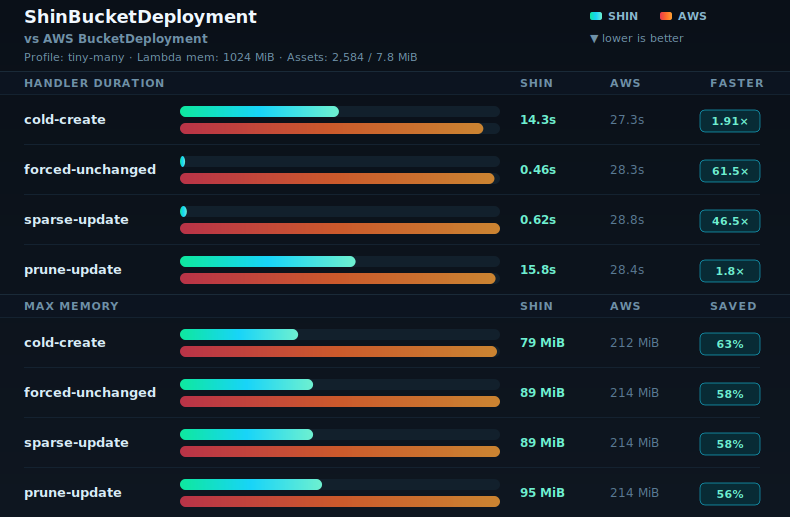
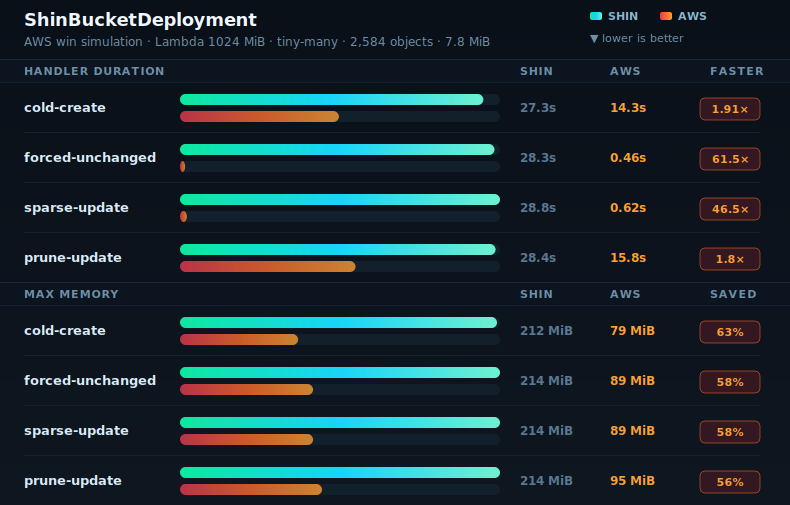
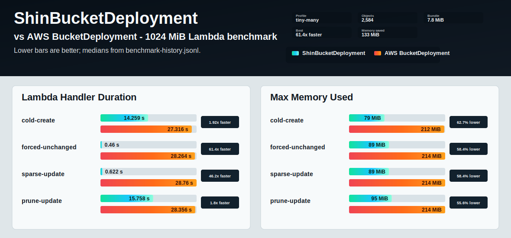
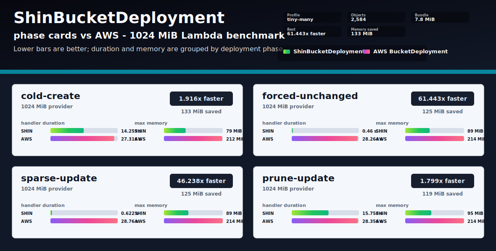

# Benchmark Chart Renderer Previews

These preview charts use the same sanitized `2026-05-09-rust-aws-tiny-many-1024` records from `docs/benchmark-history.jsonl`.

Preview-only SVGs live in `docs/benchmark-preview-assets`. The generated benchmark report chart remains in `docs/benchmark-assets`.

## Signal Split v5

Default current preview with compact bar tracks. Two metric panels, one for Lambda handler duration and one for max memory.

## Signal Split v5 Three-line Header

Alternate header layout with comparison and metadata split across separate lines.

## Signal Split v5 AWS Win Simulation

Simulated AWS-winning data to verify the winner-colored badge treatment.

## Earlier Renderer Previews

These are retained as design history.

### Signal Split v1

Two metric panels, one for Lambda handler duration and one for max memory.

### Signal Scorecard

Phase-first rows. Each phase carries compact duration and memory bars, with the handler speedup called out on the right.

### Signal Cards

Each phase gets a larger card with speedup, memory saved, duration bars, and memory bars grouped together.

### Circuit Scorecard

Scorecard renderer with an alternate high-contrast palette.

### Circuit Cards

Card renderer with the alternate high-contrast palette.

### Forge Cards

Card renderer with a warmer palette.

