# Benchmarking

This page is the human-readable benchmark snapshot for `RustBucketDeployment`. Full sanitized benchmark history is append-only JSONL in `docs/benchmark-history.jsonl`.

Runbooks, evidence collection rules, schema guidance, and sanitization rules live in the repo-local agent skill at `.agents/skills/rbd-benchmark-verification/SKILL.md`.

## Document Ownership

This file owns benchmark context and the latest sanitized human-readable performance snapshot.

`docs/benchmark-history.jsonl` owns the append-only sanitized benchmark record across runs. Before replacing the `Current Results` section here, make sure the previous and new run records are present there.

`docs/verification.md` owns correctness validation status. Validation may reference benchmark-backed coverage, but benchmark timing and memory data belongs here or in `docs/benchmark-history.jsonl`.

## Goals

Measure each deployment phase:

- local CDK build and synth time
- CDK asset publishing time
- CloudFormation custom resource time
- provider Lambda cold start and handler duration
- source ZIP planning time
- destination listing time
- skip-decision time
- source ranged-read count and bytes
- decompression/hash time
- destination `PutObject`, `CopyObject`, `DeleteObjects`, and CloudFront calls
- destination bytes uploaded/copied/deleted
- memory high-water mark and billed duration
- correctness of final destination state

Benchmark runs should answer these questions:

- How fast is cold create for different bundle shapes?
- How fast is unchanged redeploy?
- How much work is done for sparse same-size updates?
- How much work is done for pruned updates?
- How much unchanged redeploy time is spent reading and hashing existing ZIP entries because no source MD5 catalog is available?
- How effective is source block coalescing?
- Which phase dominates total deployment time: CDK, CloudFormation, provider planning, source reads, hashing, uploads, deletes, or invalidation?

## Current Harness

The `benchmark-assets` example generates deterministic static-site bundles under `.benchmark-assets/`, which is ignored by git. The same stack definition can instantiate either this construct or the upstream AWS CDK `BucketDeployment`; the benchmark implementation is the only intended comparison dimension. Rust uses its normal `Source.asset` path, including the embedded catalog optimization, while AWS uses upstream `Source.asset`.

```bash
RBD_BENCH_PROFILE=mixed RBD_BENCH_VARIANT=v1 RBD_BENCH_STACK_SUFFIX=RunA pnpm example deploy benchmark-assets
RBD_BENCH_STACK_SUFFIX=RunA pnpm example destroy benchmark-assets
RBD_BENCH_PROFILE=mixed RBD_BENCH_VARIANT=v1 RBD_BENCH_STACK_SUFFIX=RunA pnpm example deploy benchmark-assets-aws
RBD_BENCH_STACK_SUFFIX=RunA pnpm example destroy benchmark-assets-aws
```

Environment variables:

| Variable | Default | Purpose |
| --- | --- | --- |
| `RBD_BENCH_PROFILE` | `mixed` | Asset shape: `tiny-many`, `mixed`, or `large-few`. |
| `RBD_BENCH_VARIANT` | `v1` | Asset variant: `v1`, `v2`, or `pruned`. |
| `RBD_BENCH_IMPLEMENTATION` | `rust` | Deployment implementation: `rust` or `aws`. The `benchmark-assets-aws` example sets this to `aws`. |
| `RBD_BENCH_STACK_SUFFIX` | none | Adds a suffix to the benchmark stack name so multiple runs can coexist. |
| `RBD_BENCH_DESTINATION_PREFIX` | `benchmark-site` | Destination prefix inside the generated bucket. |
| `RBD_BENCH_MEMORY_LIMIT_MB` | `1024` | Provider Lambda memory size in MiB. Use distinct stack suffixes when comparing memory sizes. |
| `RBD_BENCH_PRUNE` | `true` | Set to `false` to disable prune. |
| `RBD_BENCH_WAIT` | `true` | Present for property toggling; the benchmark stack currently has no CloudFront distribution. |

Asset profiles:

| Profile | Shape | Signal |
| --- | --- | --- |
| `tiny-many` | Thousands of small JS, CSS, and JSON files. | Per-object overhead, list/skip scaling, many small uploads. |
| `mixed` | SPA-like bundle with chunks, source maps, JSON, media, and fonts. | Default realistic static-site profile. |
| `large-few` | Fewer large JS, source map, and media files. | Range reads, decompression, hash, upload streaming, block coalescing. |

Variants:

| Variant | Behavior | Signal |
| --- | --- | --- |
| `v1` | Baseline bundle. | Cold create and unchanged redeploy baseline. |
| `v2` | Same file set and sizes, with a few changed files. | Sparse same-size update behavior. |
| `pruned` | Removes about ten percent of files. | Delete planning and prune behavior. |

## Methodology Summary

The benchmark harness measures deterministic static-site bundles across create, unchanged, sparse-update, and prune-update phases. Paired Rust-vs-AWS comparison runs must use the same region, profile, variants, destination prefix, memory setting, and repetition count. The latest full workflow is maintained in `.agents/skills/rbd-benchmark-verification/SKILL.md`.

The 1024 MiB setting is the preferred default because earlier `large-few` runs showed much faster cold-create provider duration than 512 MiB while keeping billed compute cost in the same range. Memory comparison runs should still include 512, 1024, and 2048 MiB when measuring runtime tuning changes.

## Provider Telemetry

Rust benchmark rows may include the sanitized `rbd_deployment_summary` object emitted by the provider. The summary contains aggregate timings, counters, bytes, source range-read stats, and `PutObject` diagnostics, and intentionally omits bucket names, object keys, account IDs, distribution IDs, URLs, and ETags.

Generate Markdown tables and text bar charts from committed or scratch JSONL records:

```bash
pnpm benchmark:report -- --run-id 2026-05-02-large-few-memory-matrix
```

The report groups records by profile, phase, implementation, and memory size. It includes medians, p90, min/max, detailed Rust-vs-AWS metric comparisons, and generated Mermaid charts when paired implementation records exist.

Do not commit `.benchmark-runs/` raw output. Commit only curated aggregate results that do not include sensitive resource identifiers.

## History

Every committed benchmark result is represented as sanitized records in `docs/benchmark-history.jsonl`. Use `null` for unavailable JSONL fields and do not invent values. The latest collection and documentation workflow is maintained in `.agents/skills/rbd-benchmark-verification/SKILL.md`.

## Current Results

| Field | Value |
| --- | --- |
| Run date | 2026-05-09 |
| Provider implementation commit | `4f5f0ca` (`allow destination reads for replacements`) |
| Result documentation commit | Pending |
| Region | `ap-southeast-2` |
| Implementations | `rust`, `aws` |
| Profile | `mixed` |
| Baseline variant | `v1` |
| Baseline bundle | 442 files, 52,904,649 bytes |
| Comparison variants | `v2`: 442 files, 52,904,649 bytes; `pruned`: 397 files, 48,185,955 bytes |
| Provider memory | 1024 MiB |
| Cleanup | All benchmark stacks destroyed after collection |
| Notes | Paired Rust/AWS comparison. Forced unchanged rows used `RBD_BENCH_WAIT=false` on a stack with no CloudFront distribution. Rust rows include sanitized provider summary counters in `docs/benchmark-history.jsonl`. The first attempted Rust update exposed the destination `s3:GetObject` IAM gap; this snapshot records the rerun after the fix. |

Mixed Rust/AWS comparison by metric:

| Phase | Metric | Rust | AWS | AWS - Rust | AWS/Rust | AWS delta % |
| --- | --- | ---: | ---: | ---: | ---: | ---: |
| Cold create | Provider duration | 2.049 s | 9.988 s | +7.939 s | 4.875x | +387.457% |
| Cold create | Billed duration | 2.188 s | 10.535 s | +8.347 s | 4.815x | +381.49% |
| Cold create | Init duration | 0.139 s | 0.547 s | +0.408 s | 3.935x | +293.525% |
| Cold create | Local wall time | 111.89 s | 107.91 s | -3.98 s | 0.964x | -3.557% |
| Cold create | CDK deploy time | 66.3 s | 70.7 s | +4.4 s | 1.066x | +6.637% |
| Cold create | Max memory | 66 MiB | 251 MiB | +185 MiB | 3.803x | +280.303% |
| Forced unchanged | Provider duration | 0.203 s | 9.594 s | +9.391 s | 47.261x | +4626.108% |
| Forced unchanged | Billed duration | 0.203 s | 9.594 s | +9.391 s | 47.261x | +4626.108% |
| Forced unchanged | Local wall time | 57.56 s | 73.05 s | +15.49 s | 1.269x | +26.911% |
| Forced unchanged | CDK deploy time | 14.24 s | 26.5 s | +12.26 s | 1.861x | +86.096% |
| Forced unchanged | Max memory | 66 MiB | 251 MiB | +185 MiB | 3.803x | +280.303% |
| Sparse update | Provider duration | 0.376 s | 9.612 s | +9.236 s | 25.564x | +2456.383% |
| Sparse update | Billed duration | 0.377 s | 9.612 s | +9.235 s | 25.496x | +2449.602% |
| Sparse update | Local wall time | 57.38 s | 70.47 s | +13.09 s | 1.228x | +22.813% |
| Sparse update | CDK deploy time | 14.02 s | 26.41 s | +12.39 s | 1.884x | +88.374% |
| Sparse update | Max memory | 66 MiB | 251 MiB | +185 MiB | 3.803x | +280.303% |
| Prune update | Provider duration | 3.296 s | 9.204 s | +5.908 s | 2.792x | +179.248% |
| Prune update | Billed duration | 3.296 s | 9.204 s | +5.908 s | 2.792x | +179.248% |
| Prune update | Local wall time | 65.15 s | 70.18 s | +5.03 s | 1.077x | +7.721% |
| Prune update | CDK deploy time | 21.98 s | 26.53 s | +4.55 s | 1.207x | +20.701% |
| Prune update | Max memory | 68 MiB | 251 MiB | +183 MiB | 3.691x | +269.118% |

Metric charts are generated from `docs/benchmark-history.jsonl` using `pnpm benchmark:report`. Example provider-duration chart:

```mermaid
xychart-beta
  title "Provider duration by Phase"
  x-axis ["cold-create", "forced-unchanged", "sparse-update", "prune-update"]
  y-axis "s" 0 --> 20
  bar "Rust" [2.049, 0.203, 0.376, 3.296]
  bar "AWS" [9.988, 9.594, 9.612, 9.204]
```



Provider summary highlights:

| Implementation | Phase | Uploaded objects | Skipped objects | Deleted objects | Uploaded bytes | Source fetched bytes |
| --- | --- | ---: | ---: | ---: | ---: | ---: |
| Rust | Cold create | 443 | 0 | 0 | 52,904,739 | 388,708 |
| Rust | Forced unchanged | 0 | 443 | 0 | 0 | 13,133 |
| Rust | Sparse update | 7 | 436 | 0 | 1,379,280 | 307,728 |
| Rust | Prune update | 398 | 0 | 45 | 48,186,049 | 351,670 |

These results validate that the ranged, no-disk ZIP path stays comfortably below the 1024 MiB default for the `mixed` profile. The highest reported Rust memory in this paired run was 68 MB, compared with 251 MB for upstream AWS `BucketDeployment`. Rust provider duration was lower in every measured phase, especially unchanged and sparse updates where the embedded catalog avoided per-object source hashing.
